[README](README.md)

SQL Practice:

SQL(Structured Query Language): is a language designed to deal with relational databases by querying, manipulating and transforming data. It is simple, safe and scalable, so it used by millions websites and mobile apps.

Relational databases: they represent a colection of two-dimensional tables which have fixed numbers of coloumns (properties of the table) and any number of rows of data.

***
Selecting query for a specific columns:

    SELECT DISTINCT column, another_column, …

        FROM mytable

    INNER JOIN another_table 

        ON mytable.id = another_table.id

    WHERE condition(s)

    ORDER BY column ASC/DESC

    LIMIT num_limit OFFSET num_offset; 
***

Selecting query for all columns:

    SELECT * FROM mytable;

***

Inserting rows:

    INSERT INTO mytable
        (column, another_column, …)
    VALUES (value_or_expr, another_value_or_expr, …),
            (value_or_expr_2, another_value_or_expr_2, …),
      …;
      
***

Updating rows:

    UPDATE mytable
    SET column = value_or_expr, 
        other_column = another_value_or_expr, 
    …
    WHERE condition;

***

Deleting rows:

    DELETE FROM mytable
    WHERE condition;

***

Creating tables:

    CREATE TABLE IF NOT EXISTS mytable (
        column DataType TableConstraint DEFAULT default_value,
        another_column DataType TableConstraint DEFAULT default_value,
        …
    );

***

Altering tables:

    Adding columns:

        ALTER TABLE mytable
        ADD column DataType OptionalTableConstraint 
            DEFAULT default_value;

    Removing columns:

        ALTER TABLE mytable
        DROP column_to_be_deleted;
    
    Renaming the table:

        ALTER TABLE mytable
        RENAME TO new_table_name;

***

Dropping tables:

    DROP TABLE IF EXISTS mytable;

***

Screenshots of SQL practices:

Exercise 1:

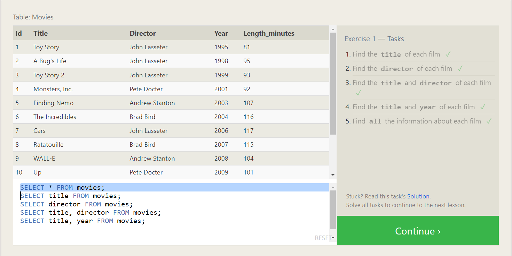

Exercise 2:

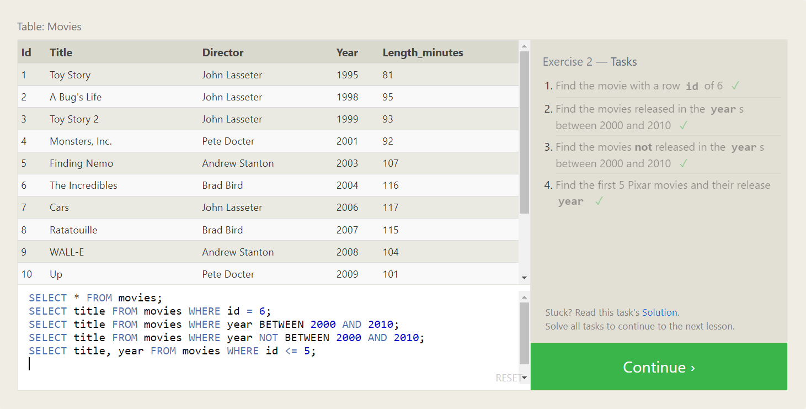

Exercise 3:

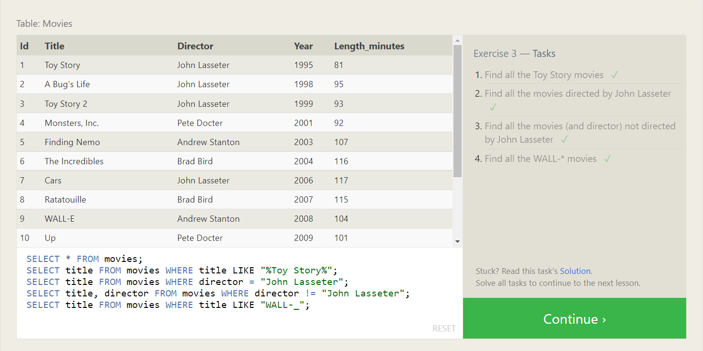

Exercise 4:

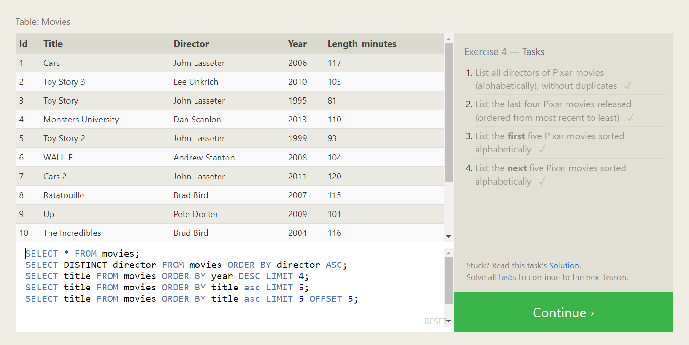

Exercise 5:

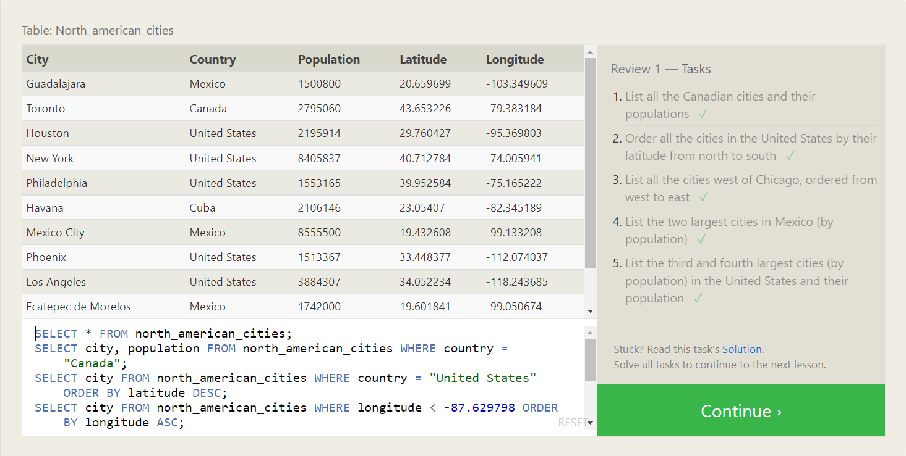

Exercise 6:

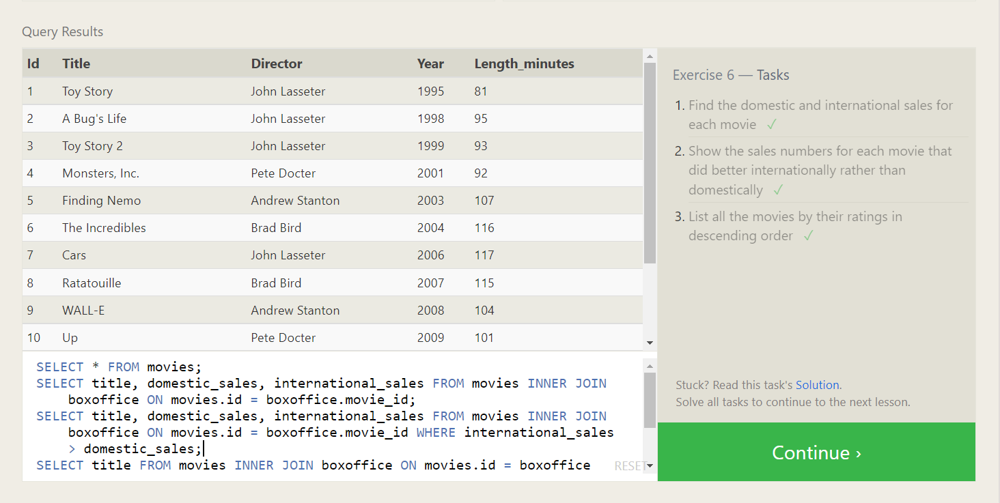

Exercise 13:

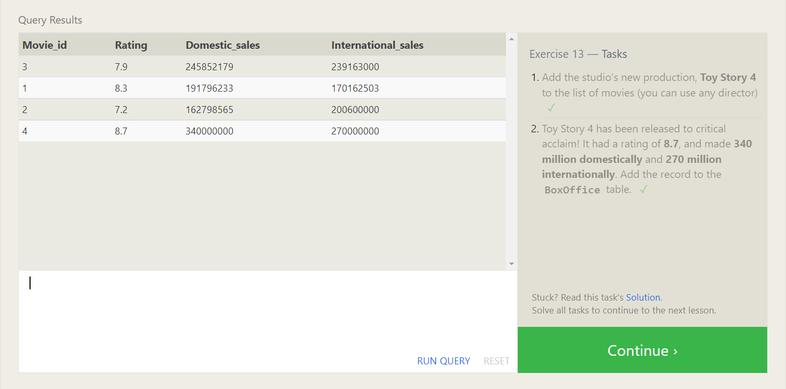

Exercise 14:

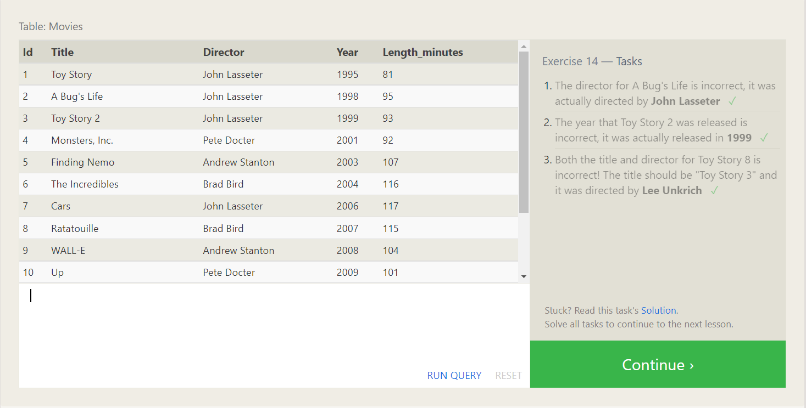

Exercise 15:

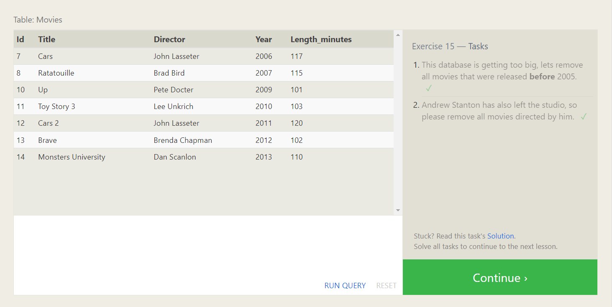

Exercise 16:

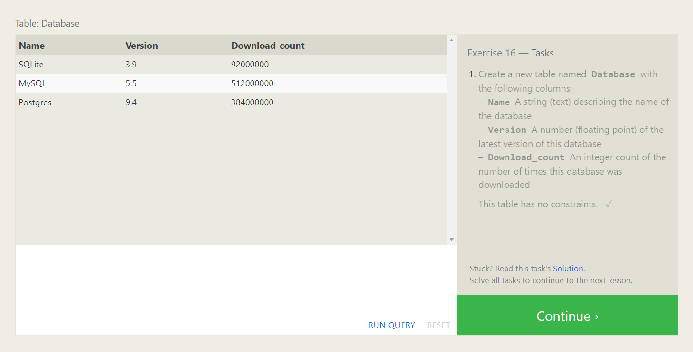

Exercise 17:

Exercise 18:

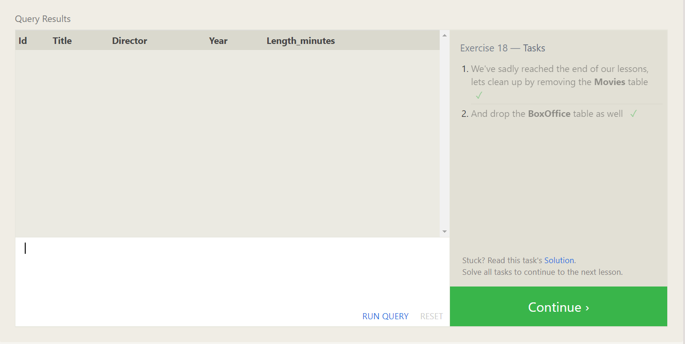

